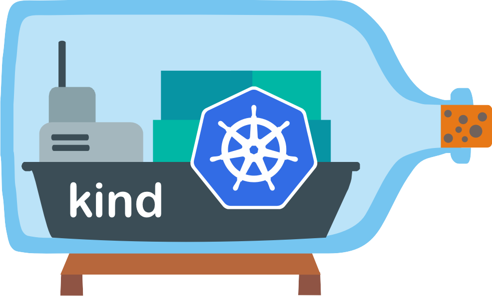

<p>
 
 
</p>
# knative local environment
A easy way to create a knative local environment.

### Dependencies 
- [kind](https://kind.sigs.k8s.io/docs/user/quick-start/#installation)
- [Kubectl](https://kubernetes.io/docs/tasks/tools/)
- [Make](https://www.gnu.org/software/make/manual/make.html)

### How to create a environment:
```sh
$ make
kind create cluster --name knative --config cluster.yaml
Creating cluster "knative" ...
 ✓ Ensuring node image (kindest/node:v1.23.13) 🖼
 ✓ Preparing nodes 📦  
 ✓ Writing configuration 📜 
 ✓ Starting control-plane 🕹️ 
 ✓ Installing CNI 🔌 
 ✓ Installing StorageClass 💾 
Set kubectl context to "kind-knative"
You can now use your cluster with:

kubectl cluster-info --context kind-knative

Not sure what to do next? 😅  Check out https://kind.sigs.k8s.io/docs/user/quick-start/
kubectl apply -f ./knative/serving/serving-crds.yaml
customresourcedefinition.apiextensions.k8s.io/certificates.networking.internal.knative.dev created
customresourcedefinition.apiextensions.k8s.io/configurations.serving.knative.dev created
customresourcedefinition.apiextensions.k8s.io/clusterdomainclaims.networking.internal.knative.dev created
customresourcedefinition.apiextensions.k8s.io/domainmappings.serving.knative.dev created
customresourcedefinition.apiextensions.k8s.io/ingresses.networking.internal.knative.dev created
customresourcedefinition.apiextensions.k8s.io/metrics.autoscaling.internal.knative.dev created
customresourcedefinition.apiextensions.k8s.io/podautoscalers.autoscaling.internal.knative.dev created
customresourcedefinition.apiextensions.k8s.io/revisions.serving.knative.dev created
customresourcedefinition.apiextensions.k8s.io/routes.serving.knative.dev created
customresourcedefinition.apiextensions.k8s.io/serverlessservices.networking.internal.knative.dev created
customresourcedefinition.apiextensions.k8s.io/services.serving.knative.dev created
customresourcedefinition.apiextensions.k8s.io/images.caching.internal.knative.dev created
kubectl apply -f ./knative/serving/serving-core.yaml
namespace/knative-serving created
clusterrole.rbac.authorization.k8s.io/knative-serving-aggregated-addressable-resolver created
clusterrole.rbac.authorization.k8s.io/knative-serving-addressable-resolver created
clusterrole.rbac.authorization.k8s.io/knative-serving-namespaced-admin created
clusterrole.rbac.authorization.k8s.io/knative-serving-namespaced-edit created
clusterrole.rbac.authorization.k8s.io/knative-serving-namespaced-view created
clusterrole.rbac.authorization.k8s.io/knative-serving-core created
clusterrole.rbac.authorization.k8s.io/knative-serving-podspecable-binding created
serviceaccount/controller created
clusterrole.rbac.authorization.k8s.io/knative-serving-admin created
clusterrolebinding.rbac.authorization.k8s.io/knative-serving-controller-admin created
clusterrolebinding.rbac.authorization.k8s.io/knative-serving-controller-addressable-resolver created
customresourcedefinition.apiextensions.k8s.io/images.caching.internal.knative.dev unchanged
customresourcedefinition.apiextensions.k8s.io/certificates.networking.internal.knative.dev unchanged
customresourcedefinition.apiextensions.k8s.io/configurations.serving.knative.dev unchanged
customresourcedefinition.apiextensions.k8s.io/clusterdomainclaims.networking.internal.knative.dev unchanged
customresourcedefinition.apiextensions.k8s.io/domainmappings.serving.knative.dev unchanged
customresourcedefinition.apiextensions.k8s.io/ingresses.networking.internal.knative.dev unchanged
customresourcedefinition.apiextensions.k8s.io/metrics.autoscaling.internal.knative.dev unchanged
customresourcedefinition.apiextensions.k8s.io/podautoscalers.autoscaling.internal.knative.dev unchanged
customresourcedefinition.apiextensions.k8s.io/revisions.serving.knative.dev unchanged
customresourcedefinition.apiextensions.k8s.io/routes.serving.knative.dev unchanged
customresourcedefinition.apiextensions.k8s.io/serverlessservices.networking.internal.knative.dev unchanged
customresourcedefinition.apiextensions.k8s.io/services.serving.knative.dev unchanged
secret/serving-certs-ctrl-ca created
secret/knative-serving-certs created
image.caching.internal.knative.dev/queue-proxy created
configmap/config-autoscaler created
configmap/config-defaults created
configmap/config-deployment created
configmap/config-domain created
configmap/config-features created
configmap/config-gc created
configmap/config-leader-election created
configmap/config-logging created
configmap/config-network created
configmap/config-observability created
configmap/config-tracing created
horizontalpodautoscaler.autoscaling/activator created
poddisruptionbudget.policy/activator-pdb created
deployment.apps/activator created
service/activator-service created
deployment.apps/autoscaler created
service/autoscaler created
deployment.apps/controller created
service/controller created
deployment.apps/domain-mapping created
deployment.apps/domainmapping-webhook created
service/domainmapping-webhook created
horizontalpodautoscaler.autoscaling/webhook created
poddisruptionbudget.policy/webhook-pdb created
deployment.apps/webhook created
service/webhook created
validatingwebhookconfiguration.admissionregistration.k8s.io/config.webhook.serving.knative.dev created
mutatingwebhookconfiguration.admissionregistration.k8s.io/webhook.serving.knative.dev created
mutatingwebhookconfiguration.admissionregistration.k8s.io/webhook.domainmapping.serving.knative.dev created
secret/domainmapping-webhook-certs created
validatingwebhookconfiguration.admissionregistration.k8s.io/validation.webhook.domainmapping.serving.knative.dev created
validatingwebhookconfiguration.admissionregistration.k8s.io/validation.webhook.serving.knative.dev created
secret/webhook-certs created
kubectl apply -f ./knative/serving/kourier.yaml
namespace/kourier-system created
configmap/kourier-bootstrap created
configmap/config-kourier created
serviceaccount/net-kourier created
clusterrole.rbac.authorization.k8s.io/net-kourier created
clusterrolebinding.rbac.authorization.k8s.io/net-kourier created
deployment.apps/net-kourier-controller created
service/net-kourier-controller created
deployment.apps/3scale-kourier-gateway created
service/kourier created
service/kourier-internal created
kubectl apply -f ./knative/eventing/eventing-crds.yaml
customresourcedefinition.apiextensions.k8s.io/apiserversources.sources.knative.dev created
customresourcedefinition.apiextensions.k8s.io/brokers.eventing.knative.dev created
customresourcedefinition.apiextensions.k8s.io/channels.messaging.knative.dev created
customresourcedefinition.apiextensions.k8s.io/containersources.sources.knative.dev created
customresourcedefinition.apiextensions.k8s.io/eventtypes.eventing.knative.dev created
customresourcedefinition.apiextensions.k8s.io/parallels.flows.knative.dev created
customresourcedefinition.apiextensions.k8s.io/pingsources.sources.knative.dev created
customresourcedefinition.apiextensions.k8s.io/sequences.flows.knative.dev created
customresourcedefinition.apiextensions.k8s.io/sinkbindings.sources.knative.dev created
customresourcedefinition.apiextensions.k8s.io/subscriptions.messaging.knative.dev created
customresourcedefinition.apiextensions.k8s.io/triggers.eventing.knative.dev created
kubectl apply -f ./knative/eventing/eventing-core.yaml
namespace/knative-eventing created
serviceaccount/eventing-controller created
clusterrolebinding.rbac.authorization.k8s.io/eventing-controller created
clusterrolebinding.rbac.authorization.k8s.io/eventing-controller-resolver created
clusterrolebinding.rbac.authorization.k8s.io/eventing-controller-source-observer created
clusterrolebinding.rbac.authorization.k8s.io/eventing-controller-sources-controller created
clusterrolebinding.rbac.authorization.k8s.io/eventing-controller-manipulator created
serviceaccount/pingsource-mt-adapter created
clusterrolebinding.rbac.authorization.k8s.io/knative-eventing-pingsource-mt-adapter created
serviceaccount/eventing-webhook created
clusterrolebinding.rbac.authorization.k8s.io/eventing-webhook created
rolebinding.rbac.authorization.k8s.io/eventing-webhook created
clusterrolebinding.rbac.authorization.k8s.io/eventing-webhook-resolver created
clusterrolebinding.rbac.authorization.k8s.io/eventing-webhook-podspecable-binding created
configmap/config-br-default-channel created
configmap/config-br-defaults created
configmap/default-ch-webhook created
configmap/config-ping-defaults created
configmap/config-features created
configmap/config-kreference-mapping created
configmap/config-leader-election created
configmap/config-logging created
configmap/config-observability created
configmap/config-sugar created
configmap/config-tracing created
deployment.apps/eventing-controller created
deployment.apps/pingsource-mt-adapter created
horizontalpodautoscaler.autoscaling/eventing-webhook created
poddisruptionbudget.policy/eventing-webhook created
deployment.apps/eventing-webhook created
service/eventing-webhook created
customresourcedefinition.apiextensions.k8s.io/apiserversources.sources.knative.dev configured
customresourcedefinition.apiextensions.k8s.io/brokers.eventing.knative.dev unchanged
customresourcedefinition.apiextensions.k8s.io/channels.messaging.knative.dev unchanged
customresourcedefinition.apiextensions.k8s.io/containersources.sources.knative.dev unchanged
customresourcedefinition.apiextensions.k8s.io/eventtypes.eventing.knative.dev unchanged
customresourcedefinition.apiextensions.k8s.io/parallels.flows.knative.dev unchanged
customresourcedefinition.apiextensions.k8s.io/pingsources.sources.knative.dev unchanged
customresourcedefinition.apiextensions.k8s.io/sequences.flows.knative.dev unchanged
customresourcedefinition.apiextensions.k8s.io/sinkbindings.sources.knative.dev unchanged
customresourcedefinition.apiextensions.k8s.io/subscriptions.messaging.knative.dev unchanged
customresourcedefinition.apiextensions.k8s.io/triggers.eventing.knative.dev unchanged
clusterrole.rbac.authorization.k8s.io/addressable-resolver created
clusterrole.rbac.authorization.k8s.io/service-addressable-resolver created
clusterrole.rbac.authorization.k8s.io/serving-addressable-resolver created
clusterrole.rbac.authorization.k8s.io/channel-addressable-resolver created
clusterrole.rbac.authorization.k8s.io/broker-addressable-resolver created
clusterrole.rbac.authorization.k8s.io/flows-addressable-resolver created
clusterrole.rbac.authorization.k8s.io/eventing-broker-filter created
clusterrole.rbac.authorization.k8s.io/eventing-broker-ingress created
clusterrole.rbac.authorization.k8s.io/eventing-config-reader created
clusterrole.rbac.authorization.k8s.io/channelable-manipulator created
clusterrole.rbac.authorization.k8s.io/meta-channelable-manipulator created
clusterrole.rbac.authorization.k8s.io/knative-eventing-namespaced-admin created
clusterrole.rbac.authorization.k8s.io/knative-messaging-namespaced-admin created
clusterrole.rbac.authorization.k8s.io/knative-flows-namespaced-admin created
clusterrole.rbac.authorization.k8s.io/knative-sources-namespaced-admin created
clusterrole.rbac.authorization.k8s.io/knative-bindings-namespaced-admin created
clusterrole.rbac.authorization.k8s.io/knative-eventing-namespaced-edit created
clusterrole.rbac.authorization.k8s.io/knative-eventing-namespaced-view created
clusterrole.rbac.authorization.k8s.io/knative-eventing-controller created
clusterrole.rbac.authorization.k8s.io/knative-eventing-pingsource-mt-adapter created
clusterrole.rbac.authorization.k8s.io/podspecable-binding created
clusterrole.rbac.authorization.k8s.io/builtin-podspecable-binding created
clusterrole.rbac.authorization.k8s.io/source-observer created
clusterrole.rbac.authorization.k8s.io/eventing-sources-source-observer created
clusterrole.rbac.authorization.k8s.io/knative-eventing-sources-controller created
clusterrole.rbac.authorization.k8s.io/knative-eventing-webhook created
role.rbac.authorization.k8s.io/knative-eventing-webhook created
validatingwebhookconfiguration.admissionregistration.k8s.io/config.webhook.eventing.knative.dev created
mutatingwebhookconfiguration.admissionregistration.k8s.io/webhook.eventing.knative.dev created
validatingwebhookconfiguration.admissionregistration.k8s.io/validation.webhook.eventing.knative.dev created
secret/eventing-webhook-certs created
mutatingwebhookconfiguration.admissionregistration.k8s.io/sinkbindings.webhook.sources.knative.dev created
```
### How to destroy a environment:
```sh
$ make delete
kind delete cluster --name knative
Deleting cluster "knative" ...
```